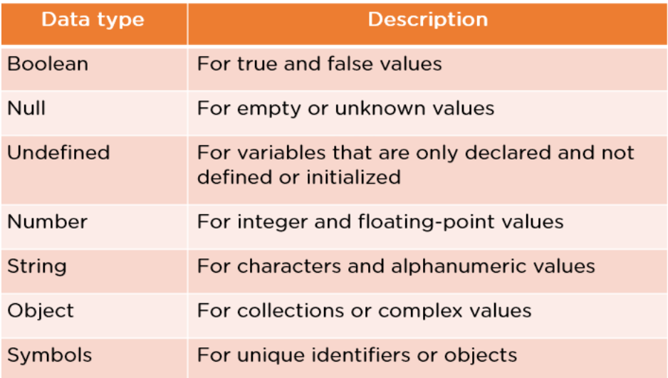
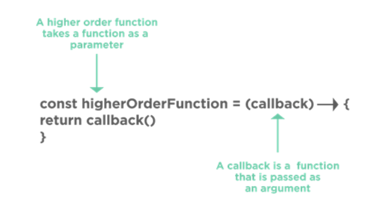

# Soft JavaScript Interview Questions

JavaScript is used to add user interaction to an application. The following section targets the commonly asked JavaScript Frontend Developer Interview Questions.

## What are the various Data Types in JavaScript?

## What is Callback in JavaScript?

A callback is a JavaScript function that is sent as an argument or parameter to another function.
You call this function whenever the function to which it is provided is called.

## What’s the difference between Function Declaration and Function Expression?

### Function Declaration

function abc(){

    return 5;

}

Within the main JavaScript code, it declares this as a separate statement. It is possible to invoke it before the function has been defined. It provides improved code readability.

### Function Expression

var a = function abc(){

    return

}

It is created inside an expression or some other construct. It is generally used when there is a need for a conditional declaration of a function.

## What do you understand about Cookies in JavaScript?

A cookie is a little piece of data sent by a website and kept on the user's computer by the web browser that was used to access the page.

Cookies are used to remember information for later use and to keep track of a website's browsing activities.

The simplest approach to make a cookie with JavaScript is to do it as follows:

document.cookie = "key1 = value1; key2 = value2; expires = date";

To delete a cookie, you can just set an expiration date and time; specifying the correct path of the cookie is a good practice.

function delete_cookie(name) {

      document.cookie = name + "=; Path=/; Expires=Thu, 01 Jan 1970 00:00:01 GMT;";

    }

## What are Closures in JavaScript?

Closures in JavaScript are a feature where an inner function has access to the outer function’s variables.

function outer_func()

{

    var b =10;

    function inner_func(){

        var a =20;

        console.log(a+b);

    }

    return inner;

}

A closure has three scope chains:

-   Has access to the variable defined within its curly braces, which is its scope.
-   Has access to the outer functions' variables.
-   Has the ability to access global variables.

## What are Imports and Exports in JavaScript?

### Export

export const sqrt = Math.sqrt;

export function square(x) {

return x \* x;

}

export function diag(x, y) {

return sqrt(square(x) + square(y));

}

This file exports two functions that calculate the squares and diagonal of the input respectively.

### Import

import { square, diag } from "calc";

console.log(square(4)); // 16

    console.log(diag(4, 3)); // 5

Here you import those functions and pass input to those functions to calculate square and diagonal.

## What is the difference between Undefined, Undeclared, and Null in JavaScript?

Undefined - Undefined means a variable has been declared but a value has not yet been assigned to that variable.

Null - Null is an assignment value that you can assign to any variable that is meant to contain no value.

Undeclared - Variables that are not declared or that do not exist in a program or application.

## What is the best way to remove Duplicates from a JavaScript Array?

You can delete duplicates from a JavaScript array in one of two ways:

By employing the filtering technique - Three arguments are required to call the filter() function. These are the array, current element, and current element index.

The For loop is used to store all the repeated elements in an empty array.

# Questions taken from r/learnprogramming

## Lexical Scoping vs Dynamic Scoping

### Lexical Scoping

-   The variable always refers to the top-level environment.
-   It makes it easy to find the scope just by reading the code.
-   It is easy to make modular code.
-   It depends on how the code is written.
-   It provides less flexibility but faster access to non-lexical variables.
-   It is unrelated to the runtime call stack. A variable's binding can be determined by the program text.

### Dynamic Scoping

-   The variable takes the latest assigned value.
-   The programmer has to consider multiple possible contexts.
-   It is not easy to make modular code.
-   It depends on how the code is executed.
-   It provides more flexibility but slower access to non-local variables.
-   It depends on the real-time stack. Each identifier has a global stack of bindings. The compiler first searches the current block and then successively searches all calling functions.

## What are the different types of variables in JavaScript? How are they different from each other?

Answers taken from MDN web docs.

### var

The var statement declares function-scoped or globally-scoped variables, optionally initializing each to a value.

The var keyword is used to declare function-scoped variables and globally-scoped variables. If you use var inside a block, the variable will not be a block scoped. It will either be function scoped or globally scoped depending upon where the block is present.

-   var declarations can be in the same scope as a function declaration. In this case, the var declaration's initializer always overrides the function's value, regardless of their relative position. This is because function declarations are hoised before any initializer gets evaluated, so the initializer comes later and overrides the value.

    -   Example:
        -   var a = 1;
        -   function a() {};
        -   console.log(a);
        -   _1_

-   var declarations cannot be in the same scope as a let, const, class, oro import declarations.

    -   var a = 1;
    -   let a = 1;
    -   _SyntaxError: Identifier 'a' has already been declared_

-   Because var declarations are not scoped to blocks, this also applies to the following case:

    -   let a = 1;
        -   {
        -   var a = 1; _SyntaxError: Identifier 'a' has already been declared_
        -   }
        -   This does not apply to the following case, where let is in a child scope of var, not the same scope:
        -   var a = 1;
        -   {
        -   let a = 1;
        -   }

-   A var declaration within a function's body can have the same name as a parameter.
    -   function foo(a) {
    -   var a = 1;
    -   console.log(a);
    -   }
    -   foo(2);
    -   _Logs 1_

### let

The let declaration declares re-assignable, block-scoped local variables, optionally initializing each to a value.

Example:

-   let x = 1;
-   if (x === 1) {
-   let x = 1;
-   console.log(x);
-   _Expected output: 2_
-   }
-   console.log(x);
-   _Expected output: 1_

Description:

The scope of a variable declared with _let_ is one of the following curly-brace-enclosed syntaxes that most closely contains the _let_ declaration.

-   Block statement
-   switch statement
-   try...catch statement
-   Body of one of the _for_ statements, if the _let_ is in the header of the statement
-   Function body
-   Static initialization block

_let_ differs from _var_ in the following ways:

-   _let_ declarations are scoped to blocks as well as functions.
-   _let_ declarations can only be accessed after the place of a declaration is reached.
    -   For this reason, _let_ declarations are commonly regarded as non-hoisted.
-   _let_ declarations do not create properties on globalThis when declared at the top level of a script.
-   _let_ declarations cannot be redeclared by any other declaration in the same scope.
-   _let_ begins delcarations, not statements. That means you cannot use a lone _let_ declaration as the body of a block.
    -   Example: if (true) let a = 1;
    -   _SyntaxError: Lexical declaration cannot appear in a single-statment context._

### Temporal Dead Zone (TDZ)

{
_TDZ starts at beginning of scope_
console.log(bar); _undefined_
console.log(foo); _ReferenceError: Cannot access 'foo' before initialization_
var bar = 1;
let foo = 2; _End of TDZ (for foo)_
}

The term "temporal" is used because the zone depends on the order of execution (time) rather than the order in which the code is written (position). For example, the code below works because, even though the function that uses the let variable appears before the variable is declared, the function is called outside the TDZ.

{
_TDZ starts at beginning of scope_
const func = () => console.log(letVar); _OK_

    _Within the TDZ access throws `ReferenceError`_

    let letVar = 3; _End of TDZ (for letVar)_
    func(); _Called outside TDZ!_

}

### const

The _const_ declaration declares block-scoped local variables. The value of a constant can't be changed through reassignment using the assignment operator, but if a constant is an object, its properties can be added, updated, or removed.

_The const declaration is very similar to let:_

-   _const_ declarations are scoped to blocks as well as functions.
-   _const_ declarations can only be accessed after the place of declaration is reached. For this reason, _const_ declarations are commonly regarded as _non-hoisted_.
-   _const_ declarations do not create properties on _globalThis_ when declared at the top level of a script.
-   _const_ declarations cannot be redeclared by any other declaration in the same scope.
-   _const_ begins declarations, not statements.
    -   That means you cannot use a lone _const_ declaration as the body of a block (which makes sense, since there's no way to access the variable).
    -   Example: if (true) const a = 1;
    -   _SyntaxError: Lexical declaration cannot appear in a single-statment context_

An initializer for a constant is required. You must specify its value in the same declaration.

-   You cannot write const FOO; _SyntaxError: Missing initializer in constant declaration._

_const_ is immutable!

## What are some different ways to create an object in JavaScript?

// Classes can be defined as function expressions or function declarations
// Declaration
class Rectangle {
constructor(height, width) {
this.height = height;
this.width = width;
}
// Getter
get area() {
return this.calcArea();
}
// Method
calcArea() {
return this.height * this.width;
}
*getSides() {
yield this.height;
yield this.width;
yield this.height;
yield this.width;
}
}

const square = new Rectangle(10, 10);

console.log(square.area); // 100
console.log([...square.getSides()]); // [10, 10, 10, 10]

// Expression; the class is anonymous but assigned to a variable
const Rectangle2 = class {
constructor(height, width) {
this.height = height;
this.width = width;
}
};

// Expression; the class has its own name
const Rectangle3 = class Rectangle4 {
constructor(height, width) {
this.height = height;
this.width = width;
}
};

## How can you get the type of a variable in JavaScript?

let x = 'hello world';
console.log(typeof x);
// output : string

## Can you tell me the difference between == and ===?

Both of these check for equality.
== is loose equality.
=== is strict equality.

## Do you know what arrow functions are?

Arrow functions are a compact alternative to a traditional function expression, with semantic differences and deliberate limitations in usage.

-   They don't have their own bindings to this, arguments, or super, and SHOULD NOT be used as methods.
-   They CANNOT be used as constructors. Calling them with 'new' throws a TypeError.
-   They DON'T have access to the new.target.
-   They CANNOT use yield within their body and CANNOT be created as generator functions.

Ex:
const animals = ['dog', 'cat', 'chicken', 'duck'];
console.log(animals.map((animal) => animal.length));
// Expected output: Array [3, 3, 7, 4]

## How are arrow functions different from traditional functions?

// Reference: https://www.freecodecamp.org/news/the-difference-between-arrow-functions-and-normal-functions/
// Video Explanation: https://www.youtube.com/watch?v=M10gzHpIUDw

Declard Arrow Function:

const multiply = (num1, num2) => {
const result = num1 \* num2
return result
}

Declared Traditional Function:

function multiply(num1, num2) {
const result = num1 \* num2
return result
}

If the return statement is the only statement in the function, you can even have a shorter function expression. For example:

const multiply = (num1, num2) => {
return num1 \* num2
}
This function only contains the return statement. With arrow functions, we can have something shorter like this:

const multiply = (num1, num2) => num1 \* num2

## What can you tell me about Callbacks?

A Callback is a function that gets passed to another function as an Argument.
Example:
const logHello = () => {
console.log('Hello');
}

setTimeout(logHello, 2000); // logHello is the Callback.

// The Stack is logged first followed by the Events
// The Event Queue is responsible for sending new
// functions to the Stack for processing.
